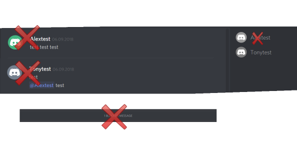

# Discord-Full-Hide-of-Users
Completely hides bar to view blocked user messages /hide avatars / hide of messages in which there are mentions of users

Based on https://gist.github.com/notcammy/5ba4880ff33a3c2dfb85323f212f5c17


**Add users:**
```
var blockusers = ["________user1_______", "______user2______"];

```

**Example**

```
var blockusers = ["Alextest"];

```

